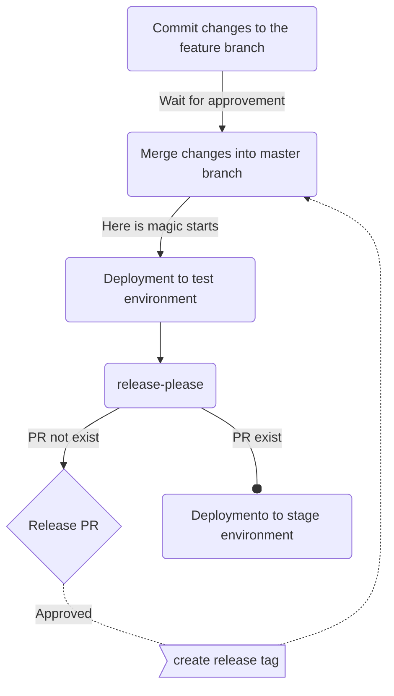

# RELEASE-PLEASE DEMO

## Repository

1. Create a new repository on [GitHub](https://github.com)
1. [Scaffold](https://vitejs.dev/guide/#scaffolding-your-first-vite-project) your ViteJS project

    ```shell
    npm create vite@latest <NAME OF APPLICATION> -- --template <TEMPLATE NAME>
    ```

1. Initialize GitHub in your project

    ```shell
    git init
    git branch -M main
    git remote add origin <URL TO YOUR REPOSITORY>
    ```

## Husky and commitlint

1. Add [husky](https://typicode.github.io/husky/) and [commitlint](https://commitlint.js.org/guides/getting-started.html) to project and configure it

    - Initialize `husky`

      ```shell
      npm install -D husky @commitlint/{cli,config-conventional} &&
      npx husky init
      ```

    - Edit `.husky/pre-commit` file with this line

      ```shell
      npm run lint
      ```

    - Add new file `.husky/commit-msg` with this content

      ```shell
      npx --no -- commitlint --edit $1
      ```

    - Configure [commitlint](https://commitlint.js.org/guides/getting-started.html) by adding bellow content to `./commitlint.config.js`

      ```js
      export default {
        extends: ['@commitlint/config-conventional']
      };
      ```

1. Enable `husky`

    ```shell
    npx husky
    ```


1. Commit and push changes

    ```shell
    git status
    git add .
    git commit -m "<COMMIT MESSAGE>"
    git push --set-upstream origin main
    ```

## [Release-please](https://github.com/googleapis/release-please)

1. Create a `.release-please-manifest.json` file to the root folder with the below content

    ```json
    {
      ".": "0.0.0"
    }
    ```

    where `0.0.0` application version from `./package.json`

1. Create `./release-please-config.json` and add this content to it

    ```json
    {
      "$schema": "https://raw.githubusercontent.com/googleapis/release-please/main/schemas/config.json",
      "release-type": "node",
      "pull-request-title-pattern": "chore(main): release${component} ${version}",
      "include-component-in-tag": false,
      "packages": {
        ".": {}
      }
    }
    ```

## [GitHub Actions](https://docs.github.com/en/actions)

1. Set up GitHub actions by adding the below content to `.github\workflows\main.yml` file

    ```yaml
    name: Create release PR

    on:
      push:
        branches:
          - main

    permissions:
      contents: write
      pull-requests: write

    jobs:

      # Pre-jobs add here... for example deploy to test env

      # Make release PR
      release-please:
        runs-on: ubuntu-latest
        outputs:
          release_created: ${{ steps.release-please.outputs.releases_created }}
          version: ${{ steps.release-please.outputs.major }}.${{ steps.release-please.outputs.minor }}.${{ steps.release-please.outputs.patch }}
        steps:
          - uses: googleapis/release-please-action@v4
            id: release-please
            with:
              target-branch: ${{ github.ref_name }}

      # Here we can do anything with merged release PR, such as deploy to stage or production, etc.
      post-release-branch-merge-job:
        needs: [release-please]
        # Check if we merged our release PR
        if: needs.release-please.outputs.release_created == 'true'
        runs-on: ubuntu-latest
        steps:
          - name: Deploy to prod environment
            run: echo "Merged to release branch and deployed to production!"
    ```

1. **IMPORTANT: To allow GitHub Actions to [create and approve](https://github.com/googleapis/release-please-action?tab=readme-ov-file#workflow-permissions) pull requests in GitHub repository settings!**

## **Important thing**

Now we can make and push changes to branch and have a release pull-request for review. Remember to use [conventional commits](https://www.conventionalcommits.org/en/v1.0.0/#specification) in your commit messages to get changes in to release pull-request.


## Example of release-please usage in the project


